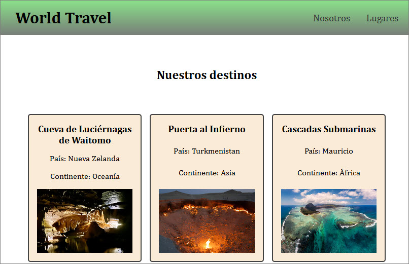

# ejercicio1
Ejercicio1 - Módulo VI - Vue

ejercicio desplegado: https://ramirezjm.github.io/ejercicio1/

[](https://choosealicense.com/licenses/mit/)


La información de la página se sirve desde un archivo json con datos de locaciones, y las tarjetas se crean de manera dinámica usando v-for y componentes.

  ```bash
   [
  {
    "id": 1,
    "name": "Cueva de Luciérnagas de Waitomo ",
    "country": "Nueva Zelanda",
    "continent": "Oceanía",
    "image": "images/waitomo.jpg"
  },....
  ```

<div>
  
</div>


### Clonar el repositorio

  ```bash
   git clone https://github.com/RamirezJM/ejercicio1.git
   cd ejercicio1
  ```

### Instalar dependencias

```bash
npm install
```

### Levantar el servidor

```bash
npm run dev
```


